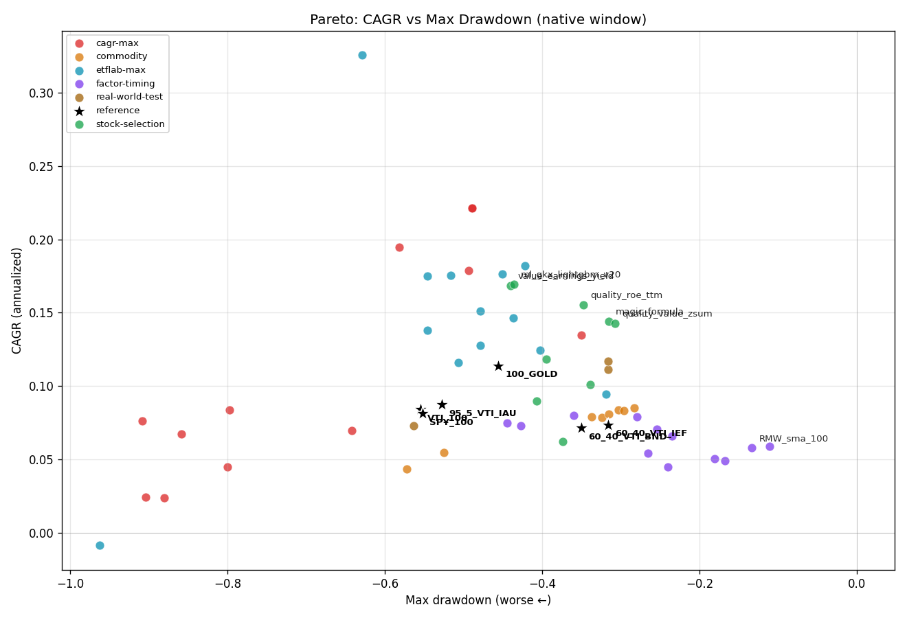
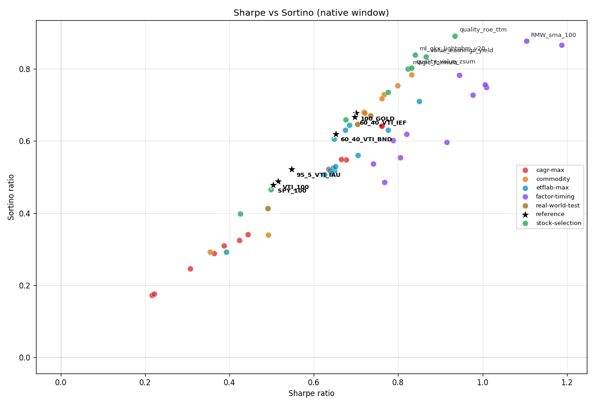
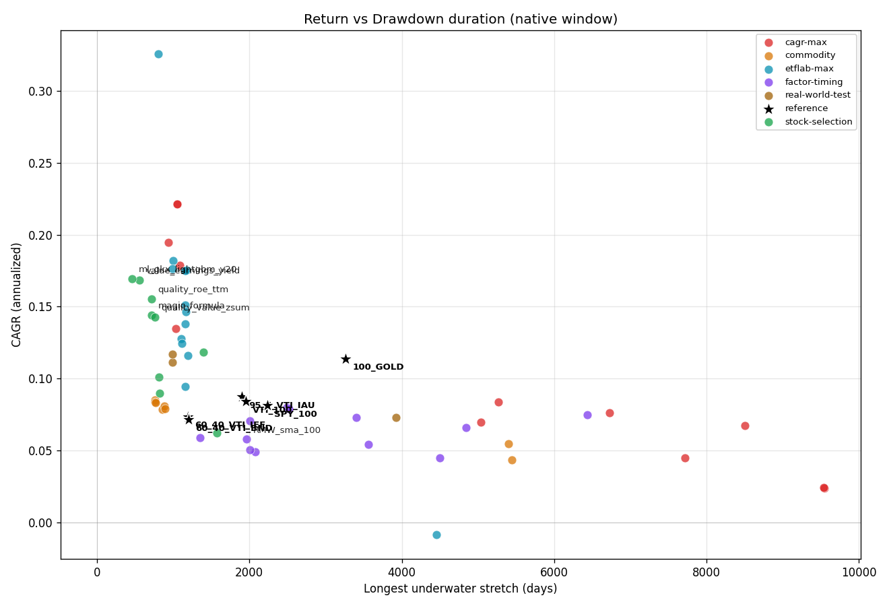
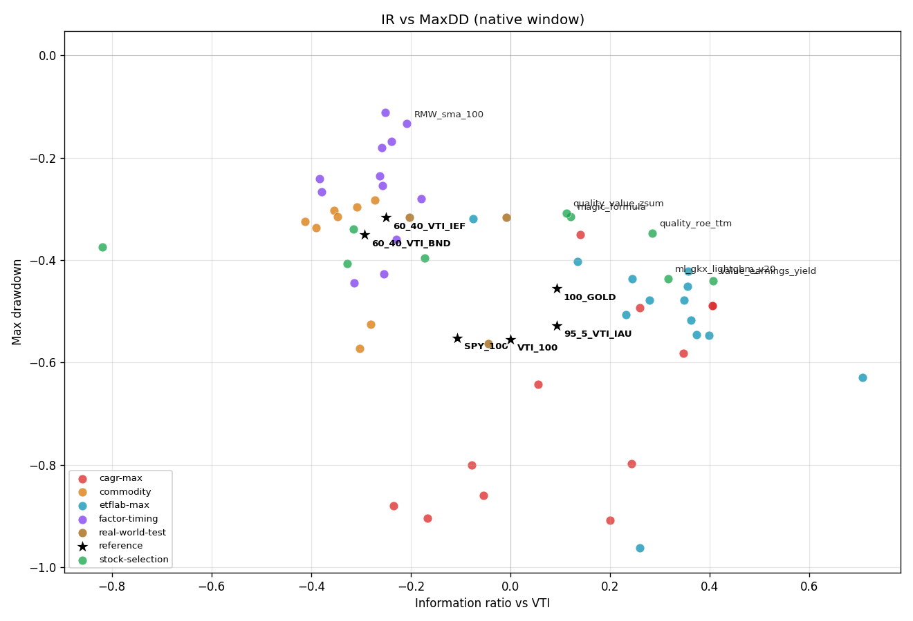
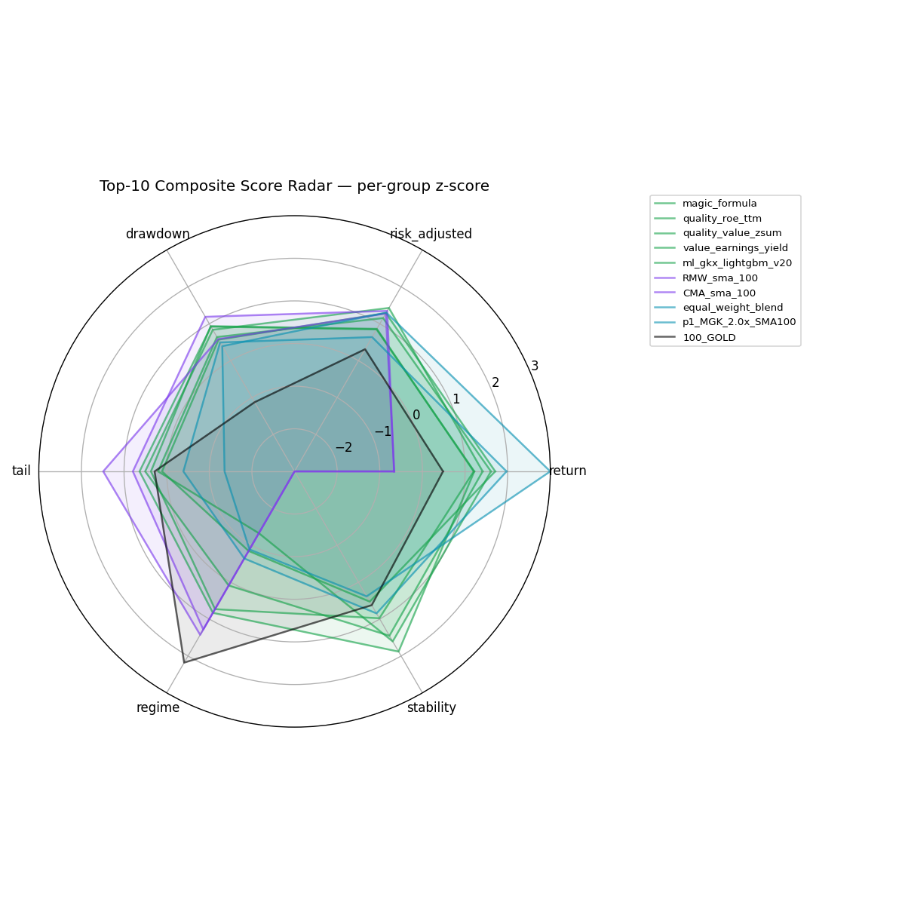
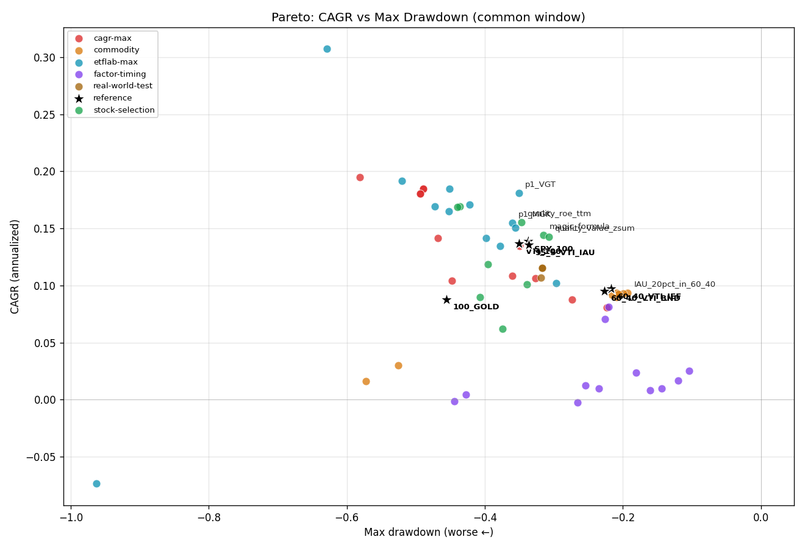
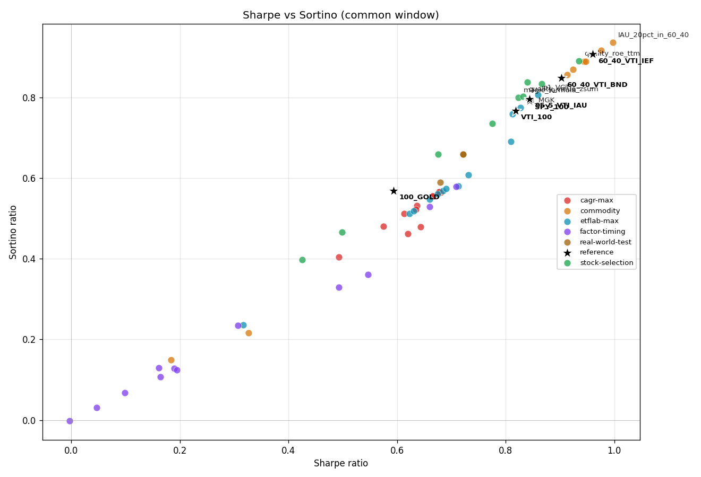
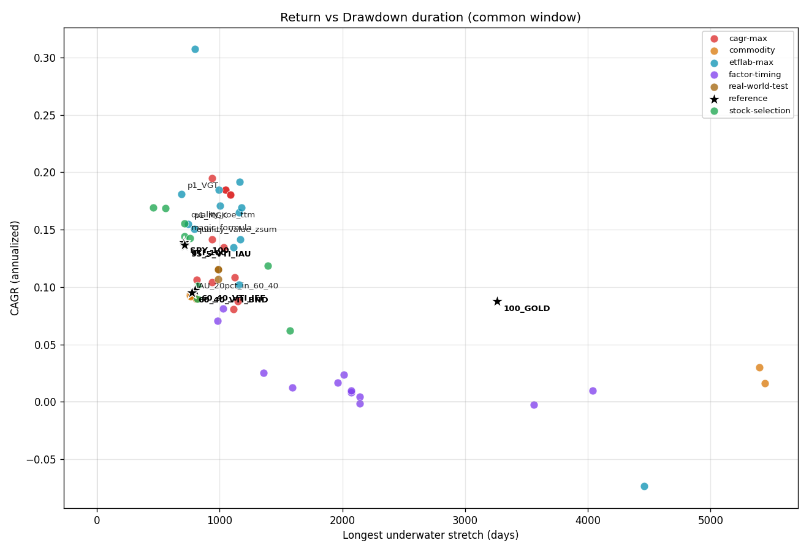
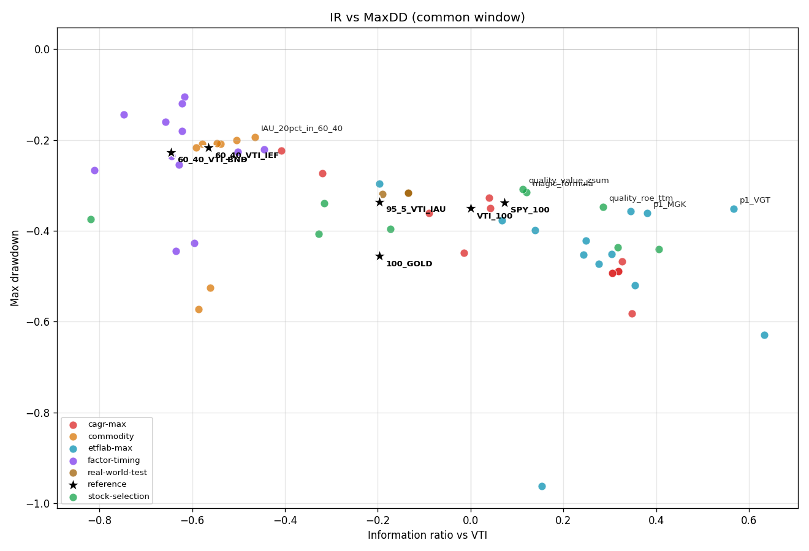
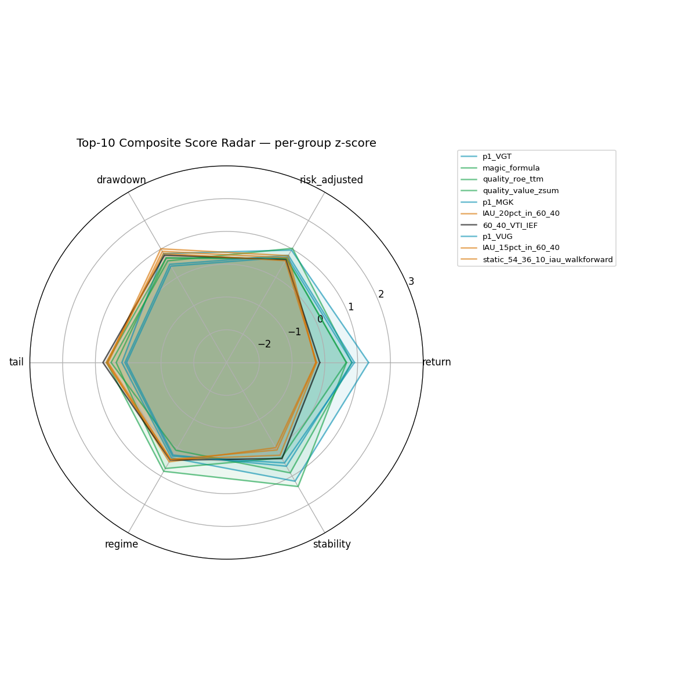

# Strategy Dashboard — Multi-Criteria Comparative Report

- Frozen: 2026-05-12T15:19:06.695382Z
- Universe: **63 strategies** (57 from 6 youBet workflows + 6 reference baselines)
- Metrics: 16 across 6 groups (return, risk-adjusted, drawdown, tail, regime, stability)
- Windows: **native** (each strategy's full history) and **common 2010-01-05 to 2026-04-30** (apples-to-apples)
- VTI universal benchmark: `workflows/real-world-test/artifacts/panel.parquet:VTI`

## How to read this report

Following the vti-as-challenger finding that strict gates can't resolve who's best given youBet's data window, this dashboard scores strategies **comparatively** across many dimensions. **No gates pass/fail.** Composite z-scores are MAD-robust (resilient to outliers), equal-weighted across metrics. Rankings are best read together with the Pareto scatter plots in `artifacts/pareto/`.

Interpretive rules:
- A composite z of +0.50 means the strategy outperforms the median on most metrics; +1.0 means a top-quartile performer broadly.
- Stock-selection candidates cluster high (mid-cap unleveraged, mostly-positive metrics with no extreme weak spot) — but they are a 2010-2026 sample, miss 2008 GFC.
- Factor-timing paper portfolios have **the highest Sharpe but lowest implementability** — Ken French long-short spreads from 1966-2026, not directly investable.
- Leveraged-SMA strategies (UPRO/MGK_2x/VTI_2.5x_SMA100) dominate CAGR but get punished on drawdown/regime metrics.
- Reference baselines (VTI/SPY/60-40/95-5) anchor the dashboard at known coordinates.

**This is descriptive, not inferential.** No multiplicity-corrected gates; rankings are sample-dependent and would shift under different windows or metric weights.

## Composite top-20 — Native window (each strategy's full history)

| Rank | ID | Workflow | Composite z | CAGR | Sharpe | Sortino | MaxDD | Calmar | IR vs VTI | Skew | GFC 2008 | COVID 2020 | 2022 |
|---:|---|---|---:|---:|---:|---:|---:|---:|---:|---:|---:|---:|---:|
| 1 | `stock_selection__magic_formula` | stock-selection | +0.901 | +14.40% | +0.823 | +0.800 | -31.52% | +0.457 | +0.121 | +0.030 | — | +5.26% | -22.03% |
| 2 | `stock_selection__quality_roe_ttm` | stock-selection | +0.887 | +15.55% | +0.935 | +0.890 | -34.72% | +0.448 | +0.285 | -0.316 | — | -2.76% | -13.43% |
| 3 | `stock_selection__quality_value_zsum` | stock-selection | +0.785 | +14.29% | +0.832 | +0.802 | -30.75% | +0.465 | +0.112 | -0.228 | — | +3.87% | -19.47% |
| 4 | `stock_selection__value_earnings_yield` | stock-selection | +0.616 | +16.86% | +0.866 | +0.834 | -43.98% | +0.383 | +0.406 | -0.293 | — | -11.06% | -10.75% |
| 5 | `stock_selection__ml_gkx_lightgbm_v20` | stock-selection | +0.611 | +16.92% | +0.840 | +0.838 | -43.61% | +0.388 | +0.317 | -0.105 | — | -15.79% | -12.11% |
| 6 | `factor_timing__RMW_sma_100` | factor-timing | +0.585 | +5.77% | +1.104 | +0.876 | -13.33% | +0.433 | -0.208 | +0.227 | +23.82% | -0.14% | -0.69% |
| 7 | `factor_timing__CMA_sma_100` | factor-timing | +0.553 | +5.88% | +1.188 | +0.866 | -11.07% | +0.531 | -0.251 | -0.586 | +3.65% | -1.11% | +25.95% |
| 8 | `etflab_max__equal_weight_blend` | etflab-max | +0.484 | +32.56% | +0.850 | +0.709 | -62.90% | +0.518 | +0.707 | -0.664 | +9.00% | -36.24% | -41.09% |
| 9 | `etflab_max__p1_MGK_2.0x_SMA100` | etflab-max | +0.442 | +18.20% | +0.776 | +0.630 | -42.20% | +0.431 | +0.357 | -0.682 | +7.83% | -21.99% | -25.80% |
| 10 | `ref__100_GOLD` | reference | +0.439 | +11.38% | +0.700 | +0.677 | -45.56% | +0.250 | +0.093 | -0.266 | +24.04% | +9.09% | -0.77% |
| 11 | `cagr_max__UPRO_3x_SMA100` | cagr-max | +0.370 | +22.14% | +0.761 | +0.641 | -48.92% | +0.453 | +0.405 | -0.764 | — | -3.52% | -44.81% |
| 12 | `cagr_max__UPRO_SMA100_real` | cagr-max | +0.370 | +22.14% | +0.761 | +0.641 | -48.92% | +0.453 | +0.405 | -0.764 | — | -3.52% | -44.81% |
| 13 | `commodity__IAU_20pct_in_60_40` | commodity | +0.353 | +8.52% | +0.831 | +0.784 | -28.26% | +0.301 | -0.272 | -0.260 | -11.23% | +0.61% | -13.49% |
| 14 | `factor_timing__RMW_sma_200` | factor-timing | +0.346 | +4.90% | +0.945 | +0.782 | -16.78% | +0.292 | -0.238 | +0.195 | +23.56% | +0.16% | +2.21% |
| 15 | `stock_selection__lowvol_252` | stock-selection | +0.325 | +10.11% | +0.776 | +0.735 | -33.92% | +0.298 | -0.315 | -0.523 | — | -10.54% | -2.44% |
| 16 | `commodity__static_54_36_10_iau_walkforward` | commodity | +0.308 | +8.36% | +0.767 | +0.728 | -30.27% | +0.276 | -0.354 | -0.057 | -12.18% | +0.24% | -14.91% |
| 17 | `commodity__IAU_15pct_in_60_40` | commodity | +0.281 | +8.32% | +0.799 | +0.754 | -29.61% | +0.281 | -0.307 | -0.223 | -13.32% | +0.08% | -14.29% |
| 18 | `factor_timing__HML_sma_100` | factor-timing | +0.257 | +7.04% | +1.009 | +0.749 | -25.41% | +0.277 | -0.257 | -0.026 | -8.62% | +0.41% | +22.18% |
| 19 | `etflab_max__p1_VGT` | etflab-max | +0.247 | +13.80% | +0.684 | +0.644 | -54.63% | +0.253 | +0.399 | -0.043 | -28.86% | +3.09% | -29.70% |
| 20 | `etflab_max__p1_MGK` | etflab-max | +0.242 | +12.77% | +0.674 | +0.630 | -47.85% | +0.267 | +0.349 | -0.099 | -30.56% | +3.46% | -33.59% |

## Composite top-20 — Common window 2010-01-05 to 2026-04-30

| Rank | ID | Workflow | Composite z | CAGR | Sharpe | Sortino | MaxDD | Calmar | IR vs VTI | Skew | GFC 2008 | COVID 2020 | 2022 |
|---:|---|---|---:|---:|---:|---:|---:|---:|---:|---:|---:|---:|---:|
| 1 | `etflab_max__p1_VGT` | etflab-max | +0.792 | +18.11% | +0.859 | +0.806 | -35.07% | +0.516 | +0.567 | -0.109 | — | +3.09% | -29.70% |
| 2 | `stock_selection__magic_formula` | stock-selection | +0.733 | +14.40% | +0.823 | +0.800 | -31.52% | +0.457 | +0.121 | +0.030 | — | +5.26% | -22.03% |
| 3 | `stock_selection__quality_roe_ttm` | stock-selection | +0.661 | +15.55% | +0.935 | +0.890 | -34.72% | +0.448 | +0.285 | -0.316 | — | -2.76% | -13.43% |
| 4 | `stock_selection__quality_value_zsum` | stock-selection | +0.596 | +14.29% | +0.832 | +0.802 | -30.75% | +0.465 | +0.112 | -0.228 | — | +3.87% | -19.47% |
| 5 | `etflab_max__p1_MGK` | etflab-max | +0.523 | +15.51% | +0.827 | +0.775 | -36.01% | +0.431 | +0.381 | -0.190 | — | +3.46% | -33.59% |
| 6 | `commodity__IAU_20pct_in_60_40` | commodity | +0.492 | +9.36% | +0.997 | +0.935 | -19.28% | +0.486 | -0.466 | -0.488 | — | +0.61% | -13.49% |
| 7 | `ref__60_40_VTI_IEF` | reference | +0.488 | +9.71% | +0.961 | +0.907 | -21.69% | +0.447 | -0.565 | -0.246 | — | +0.92% | -17.19% |
| 8 | `etflab_max__p1_VUG` | etflab-max | +0.476 | +15.06% | +0.812 | +0.759 | -35.61% | +0.423 | +0.345 | -0.263 | — | +3.03% | -33.16% |
| 9 | `commodity__IAU_15pct_in_60_40` | commodity | +0.450 | +9.32% | +0.976 | +0.916 | -19.97% | +0.467 | -0.504 | -0.488 | — | +0.08% | -14.29% |
| 10 | `commodity__static_54_36_10_iau_walkforward` | commodity | +0.444 | +9.33% | +0.944 | +0.889 | -20.86% | +0.447 | -0.539 | -0.399 | — | +0.24% | -14.91% |
| 11 | `ref__SPY_100` | reference | +0.437 | +13.89% | +0.844 | +0.792 | -33.72% | +0.412 | +0.073 | -0.329 | — | -4.86% | -18.18% |
| 12 | `commodity__iau_sma100_sleeve` | commodity | +0.406 | +9.00% | +0.924 | +0.869 | -20.86% | +0.432 | -0.579 | -0.412 | — | +0.24% | -14.46% |
| 13 | `commodity__IAU_10pct_in_60_40` | commodity | +0.406 | +9.27% | +0.948 | +0.889 | -20.68% | +0.448 | -0.546 | -0.488 | — | -0.44% | -15.09% |
| 14 | `ref__95_5_VTI_IAU` | reference | +0.384 | +13.58% | +0.844 | +0.796 | -33.59% | +0.404 | -0.196 | -0.346 | — | -4.62% | -18.54% |
| 15 | `stock_selection__ml_gkx_lightgbm_v20` | stock-selection | +0.376 | +16.92% | +0.840 | +0.838 | -43.61% | +0.388 | +0.317 | -0.105 | — | -15.79% | -12.11% |
| 16 | `stock_selection__value_earnings_yield` | stock-selection | +0.351 | +16.86% | +0.866 | +0.834 | -43.98% | +0.383 | +0.406 | -0.293 | — | -11.06% | -10.75% |
| 17 | `commodity__IAU_5pct_in_60_40` | commodity | +0.347 | +9.21% | +0.914 | +0.855 | -21.59% | +0.426 | -0.592 | -0.485 | — | -0.96% | -15.90% |
| 18 | `ref__60_40_VTI_BND` | reference | +0.347 | +9.54% | +0.902 | +0.848 | -22.70% | +0.420 | -0.645 | -0.401 | — | -0.89% | -16.47% |
| 19 | `ref__VTI_100` | reference | +0.346 | +13.68% | +0.818 | +0.767 | -35.00% | +0.391 | +0.000 | -0.359 | — | -5.53% | -19.52% |
| 20 | `etflab_max__equal_weight_blend` | etflab-max | +0.171 | +30.72% | +0.810 | +0.691 | -62.90% | +0.488 | +0.633 | -0.680 | — | -36.24% | -41.09% |

## Per-group leaderboards

Each group is the MAD-z mean of its constituent metrics. A strategy can be tops in one group and below-median in another.

### Per-group leaderboards (native window)

#### Return

| Rank | ID | Workflow | Group z |
|---:|---|---|---:|
| 1 | `etflab_max__equal_weight_blend` | etflab-max | +3.000 |
| 2 | `cagr_max__UPRO_3x_SMA100` | cagr-max | +2.473 |
| 3 | `cagr_max__UPRO_SMA100_real` | cagr-max | +2.473 |
| 4 | `cagr_max__TQQQ_SMA100_real` | cagr-max | +2.151 |
| 5 | `etflab_max__p1_MGK_2.0x_SMA100` | etflab-max | +1.974 |
| 6 | `etflab_max__VTI_3.0x_SMA100` | etflab-max | +1.902 |
| 7 | `etflab_max__p1_VGT_2.0x_SMA100` | etflab-max | +1.854 |
| 8 | `etflab_max__macro_factor_aggressive_2.5x_SMA100` | etflab-max | +1.825 |

#### Risk_Adjusted

| Rank | ID | Workflow | Group z |
|---:|---|---|---:|
| 1 | `stock_selection__quality_roe_ttm` | stock-selection | +1.429 |
| 2 | `factor_timing__CMA_sma_100` | factor-timing | +1.348 |
| 3 | `etflab_max__equal_weight_blend` | etflab-max | +1.303 |
| 4 | `stock_selection__value_earnings_yield` | stock-selection | +1.288 |
| 5 | `factor_timing__RMW_sma_100` | factor-timing | +1.278 |
| 6 | `stock_selection__ml_gkx_lightgbm_v20` | stock-selection | +1.154 |
| 7 | `stock_selection__quality_value_zsum` | stock-selection | +0.862 |
| 8 | `stock_selection__magic_formula` | stock-selection | +0.847 |

#### Drawdown

| Rank | ID | Workflow | Group z |
|---:|---|---|---:|
| 1 | `factor_timing__CMA_sma_100` | factor-timing | +1.188 |
| 2 | `stock_selection__quality_value_zsum` | stock-selection | +0.935 |
| 3 | `stock_selection__magic_formula` | stock-selection | +0.922 |
| 4 | `stock_selection__quality_roe_ttm` | stock-selection | +0.837 |
| 5 | `stock_selection__ml_gkx_lightgbm_v20` | stock-selection | +0.640 |
| 6 | `factor_timing__RMW_sma_100` | factor-timing | +0.583 |
| 7 | `commodity__IAU_20pct_in_60_40` | commodity | +0.576 |
| 8 | `stock_selection__value_earnings_yield` | stock-selection | +0.569 |

#### Tail

| Rank | ID | Workflow | Group z |
|---:|---|---|---:|
| 1 | `factor_timing__RMW_sma_100` | factor-timing | +1.489 |
| 2 | `factor_timing__RMW_sma_200` | factor-timing | +1.356 |
| 3 | `factor_timing__HML_sma_200` | factor-timing | +1.159 |
| 4 | `factor_timing__HML_sma_100` | factor-timing | +1.089 |
| 5 | `factor_timing__CMA_sma_100` | factor-timing | +0.793 |
| 6 | `ref__60_40_VTI_IEF` | reference | +0.758 |
| 7 | `commodity__static_54_36_10_iau_walkforward` | commodity | +0.700 |
| 8 | `commodity__iau_sma100_sleeve` | commodity | +0.694 |

#### Regime

| Rank | ID | Workflow | Group z |
|---:|---|---|---:|
| 1 | `ref__100_GOLD` | reference | +2.180 |
| 2 | `factor_timing__RMW_sma_200` | factor-timing | +1.498 |
| 3 | `factor_timing__RMW_sma_100` | factor-timing | +1.428 |
| 4 | `commodity__macro_dbc_additive` | commodity | +1.407 |
| 5 | `factor_timing__CMA_sma_100` | factor-timing | +1.284 |
| 6 | `commodity__macro_dbc_dollar_only` | commodity | +1.153 |
| 7 | `factor_timing__CMA_sma_200` | factor-timing | +1.029 |
| 8 | `factor_timing__HML_sma_200` | factor-timing | +1.028 |

#### Stability

| Rank | ID | Workflow | Group z |
|---:|---|---|---:|
| 1 | `stock_selection__momentum_252_21` | stock-selection | +3.000 |
| 2 | `stock_selection__lowvol_252` | stock-selection | +2.541 |
| 3 | `stock_selection__magic_formula` | stock-selection | +1.882 |
| 4 | `stock_selection__ml_gkx_elasticnet_v20` | stock-selection | +1.709 |
| 5 | `stock_selection__ml_gkx_lightgbm_v20` | stock-selection | +1.606 |
| 6 | `stock_selection__quality_roe_ttm` | stock-selection | +1.453 |
| 7 | `cagr_max__TQQQ_SMA100_real` | cagr-max | +1.138 |
| 8 | `stock_selection__piotroski_f_min7` | stock-selection | +1.095 |

### Per-group leaderboards (common window)

#### Return

| Rank | ID | Workflow | Group z |
|---:|---|---|---:|
| 1 | `etflab_max__equal_weight_blend` | etflab-max | +3.000 |
| 2 | `etflab_max__VTI_3.0x_SMA100` | etflab-max | +1.676 |
| 3 | `cagr_max__TQQQ_SMA100_real` | cagr-max | +1.431 |
| 4 | `etflab_max__p1_VGT_2.0x_SMA100` | etflab-max | +1.386 |
| 5 | `cagr_max__UPRO_3x_SMA100` | cagr-max | +1.340 |
| 6 | `cagr_max__UPRO_SMA100_real` | cagr-max | +1.340 |
| 7 | `etflab_max__p1_VGT` | etflab-max | +1.334 |
| 8 | `cagr_max__UPRO_SMA100_synthetic` | cagr-max | +1.260 |

#### Risk_Adjusted

| Rank | ID | Workflow | Group z |
|---:|---|---|---:|
| 1 | `stock_selection__quality_roe_ttm` | stock-selection | +1.024 |
| 2 | `etflab_max__p1_VGT` | etflab-max | +0.962 |
| 3 | `stock_selection__value_earnings_yield` | stock-selection | +0.917 |
| 4 | `stock_selection__ml_gkx_lightgbm_v20` | stock-selection | +0.835 |
| 5 | `etflab_max__equal_weight_blend` | etflab-max | +0.787 |
| 6 | `etflab_max__p1_MGK` | etflab-max | +0.776 |
| 7 | `commodity__IAU_20pct_in_60_40` | commodity | +0.765 |
| 8 | `etflab_max__p1_VUG` | etflab-max | +0.713 |

#### Drawdown

| Rank | ID | Workflow | Group z |
|---:|---|---|---:|
| 1 | `commodity__IAU_20pct_in_60_40` | commodity | +1.007 |
| 2 | `commodity__IAU_15pct_in_60_40` | commodity | +0.916 |
| 3 | `commodity__IAU_10pct_in_60_40` | commodity | +0.848 |
| 4 | `commodity__static_54_36_10_iau_walkforward` | commodity | +0.842 |
| 5 | `etflab_max__p1_VGT` | etflab-max | +0.839 |
| 6 | `ref__60_40_VTI_IEF` | reference | +0.784 |
| 7 | `commodity__IAU_5pct_in_60_40` | commodity | +0.745 |
| 8 | `commodity__iau_sma100_sleeve` | commodity | +0.736 |

#### Tail

| Rank | ID | Workflow | Group z |
|---:|---|---|---:|
| 1 | `factor_timing__RMW_sma_100` | factor-timing | +1.798 |
| 2 | `factor_timing__RMW_sma_200` | factor-timing | +1.671 |
| 3 | `factor_timing__SMB_sma_200` | factor-timing | +1.404 |
| 4 | `factor_timing__CMA_sma_100` | factor-timing | +1.275 |
| 5 | `factor_timing__SMB_sma_100` | factor-timing | +1.217 |
| 6 | `factor_timing__HML_sma_200` | factor-timing | +1.182 |
| 7 | `factor_timing__HML_sma_100` | factor-timing | +1.048 |
| 8 | `factor_timing__CMA_sma_200` | factor-timing | +1.032 |

#### Regime

| Rank | ID | Workflow | Group z |
|---:|---|---|---:|
| 1 | `ref__100_GOLD` | reference | +1.875 |
| 2 | `factor_timing__HML_sma_100` | factor-timing | +1.443 |
| 3 | `factor_timing__HML_sma_200` | factor-timing | +1.423 |
| 4 | `factor_timing__CMA_sma_100` | factor-timing | +1.361 |
| 5 | `factor_timing__CMA_sma_200` | factor-timing | +1.141 |
| 6 | `factor_timing__RMW_sma_200` | factor-timing | +0.870 |
| 7 | `stock_selection__magic_formula` | stock-selection | +0.832 |
| 8 | `factor_timing__SMB_sma_200` | factor-timing | +0.793 |

#### Stability

| Rank | ID | Workflow | Group z |
|---:|---|---|---:|
| 1 | `stock_selection__momentum_252_21` | stock-selection | +3.000 |
| 2 | `stock_selection__lowvol_252` | stock-selection | +2.105 |
| 3 | `factor_timing__RMW_sma_100` | factor-timing | +1.603 |
| 4 | `stock_selection__magic_formula` | stock-selection | +1.367 |
| 5 | `factor_timing__RMW_sma_200` | factor-timing | +1.342 |
| 6 | `etflab_max__p1_VGT` | etflab-max | +1.181 |
| 7 | `stock_selection__ml_gkx_elasticnet_v20` | stock-selection | +1.174 |
| 8 | `stock_selection__ml_gkx_lightgbm_v20` | stock-selection | +1.059 |

## Per-metric top-5 leaderboards (native window)

Who wins on each individual dimension. Native windows here, so coverage varies by strategy.

### Group Return

#### Cagr

| Rank | ID | Workflow | Value |
|---:|---|---|---:|
| 1 | `etflab_max__equal_weight_blend` | etflab-max | +32.56% |
| 2 | `cagr_max__UPRO_3x_SMA100` | cagr-max | +22.14% |
| 3 | `cagr_max__UPRO_SMA100_real` | cagr-max | +22.14% |
| 4 | `cagr_max__TQQQ_SMA100_real` | cagr-max | +19.48% |
| 5 | `etflab_max__p1_MGK_2.0x_SMA100` | etflab-max | +18.20% |

#### Annualized Return

| Rank | ID | Workflow | Value |
|---:|---|---|---:|
| 1 | `etflab_max__equal_weight_blend` | etflab-max | +32.56% |
| 2 | `cagr_max__UPRO_3x_SMA100` | cagr-max | +22.14% |
| 3 | `cagr_max__UPRO_SMA100_real` | cagr-max | +22.14% |
| 4 | `cagr_max__TQQQ_SMA100_real` | cagr-max | +19.48% |
| 5 | `etflab_max__p1_MGK_2.0x_SMA100` | etflab-max | +18.20% |

#### Median Rolling 1Y Return

| Rank | ID | Workflow | Value |
|---:|---|---|---:|
| 1 | `etflab_max__equal_weight_blend` | etflab-max | +37.91% |
| 2 | `etflab_max__VTI_3.0x_SMA100` | etflab-max | +20.59% |
| 3 | `etflab_max__p1_MGK_2.0x_SMA100` | etflab-max | +19.88% |
| 4 | `cagr_max__TQQQ_SMA100_real` | cagr-max | +19.59% |
| 5 | `cagr_max__UPRO_3x_SMA100` | cagr-max | +19.34% |

### Group Risk Adjusted

#### Sharpe

| Rank | ID | Workflow | Value |
|---:|---|---|---:|
| 1 | `factor_timing__CMA_sma_100` | factor-timing | +1.188 |
| 2 | `factor_timing__RMW_sma_100` | factor-timing | +1.104 |
| 3 | `factor_timing__HML_sma_100` | factor-timing | +1.009 |
| 4 | `factor_timing__CMA_sma_200` | factor-timing | +1.005 |
| 5 | `factor_timing__HML_sma_200` | factor-timing | +0.977 |

#### Sortino

| Rank | ID | Workflow | Value |
|---:|---|---|---:|
| 1 | `stock_selection__quality_roe_ttm` | stock-selection | +0.890 |
| 2 | `factor_timing__RMW_sma_100` | factor-timing | +0.876 |
| 3 | `factor_timing__CMA_sma_100` | factor-timing | +0.866 |
| 4 | `stock_selection__ml_gkx_lightgbm_v20` | stock-selection | +0.838 |
| 5 | `stock_selection__value_earnings_yield` | stock-selection | +0.834 |

#### Info Ratio Vs Vti

| Rank | ID | Workflow | Value |
|---:|---|---|---:|
| 1 | `etflab_max__equal_weight_blend` | etflab-max | +0.707 |
| 2 | `stock_selection__value_earnings_yield` | stock-selection | +0.406 |
| 3 | `cagr_max__UPRO_3x_SMA100` | cagr-max | +0.405 |
| 4 | `cagr_max__UPRO_SMA100_real` | cagr-max | +0.405 |
| 5 | `etflab_max__p1_VGT` | etflab-max | +0.399 |

### Group Drawdown

#### Max Drawdown

| Rank | ID | Workflow | Value |
|---:|---|---|---:|
| 1 | `factor_timing__CMA_sma_100` | factor-timing | -11.07% |
| 2 | `factor_timing__RMW_sma_100` | factor-timing | -13.33% |
| 3 | `factor_timing__RMW_sma_200` | factor-timing | -16.78% |
| 4 | `factor_timing__CMA_sma_200` | factor-timing | -18.07% |
| 5 | `factor_timing__HML_sma_200` | factor-timing | -23.46% |

#### Calmar

| Rank | ID | Workflow | Value |
|---:|---|---|---:|
| 1 | `factor_timing__CMA_sma_100` | factor-timing | +0.531 |
| 2 | `etflab_max__equal_weight_blend` | etflab-max | +0.518 |
| 3 | `stock_selection__quality_value_zsum` | stock-selection | +0.465 |
| 4 | `stock_selection__magic_formula` | stock-selection | +0.457 |
| 5 | `cagr_max__UPRO_3x_SMA100` | cagr-max | +0.453 |

#### Longest Underwater Days

| Rank | ID | Workflow | Value |
|---:|---|---|---:|
| 1 | `stock_selection__ml_gkx_lightgbm_v20` | stock-selection | 456 |
| 2 | `stock_selection__value_earnings_yield` | stock-selection | 556 |
| 3 | `stock_selection__quality_roe_ttm` | stock-selection | 712 |
| 4 | `stock_selection__magic_formula` | stock-selection | 715 |
| 5 | `stock_selection__quality_value_zsum` | stock-selection | 757 |

### Group Tail

#### Cvar 95

| Rank | ID | Workflow | Value |
|---:|---|---|---:|
| 1 | `factor_timing__CMA_sma_100` | factor-timing | -0.75% |
| 2 | `factor_timing__CMA_sma_200` | factor-timing | -0.77% |
| 3 | `factor_timing__RMW_sma_100` | factor-timing | -0.78% |
| 4 | `factor_timing__RMW_sma_200` | factor-timing | -0.79% |
| 5 | `factor_timing__SMB_sma_100` | factor-timing | -0.95% |

#### Skew

| Rank | ID | Workflow | Value |
|---:|---|---|---:|
| 1 | `factor_timing__RMW_sma_100` | factor-timing | +0.227 |
| 2 | `factor_timing__RMW_sma_200` | factor-timing | +0.195 |
| 3 | `ref__SPY_100` | reference | +0.034 |
| 4 | `stock_selection__magic_formula` | stock-selection | +0.030 |
| 5 | `factor_timing__HML_sma_200` | factor-timing | +0.025 |

#### Worst Rolling 12Mo

| Rank | ID | Workflow | Value |
|---:|---|---|---:|
| 1 | `factor_timing__CMA_sma_100` | factor-timing | -9.66% |
| 2 | `factor_timing__RMW_sma_100` | factor-timing | -9.76% |
| 3 | `factor_timing__RMW_sma_200` | factor-timing | -14.67% |
| 4 | `factor_timing__HML_sma_200` | factor-timing | -14.67% |
| 5 | `factor_timing__HML_sma_100` | factor-timing | -15.56% |

### Group Regime

#### Return Gfc 2008

| Rank | ID | Workflow | Value |
|---:|---|---|---:|
| 1 | `commodity__macro_dbc_additive` | commodity | +51.55% |
| 2 | `commodity__macro_dbc_dollar_only` | commodity | +46.64% |
| 3 | `ref__100_GOLD` | reference | +24.04% |
| 4 | `factor_timing__RMW_sma_100` | factor-timing | +23.82% |
| 5 | `factor_timing__RMW_sma_200` | factor-timing | +23.56% |

#### Return Covid 2020

| Rank | ID | Workflow | Value |
|---:|---|---|---:|
| 1 | `ref__100_GOLD` | reference | +9.09% |
| 2 | `stock_selection__magic_formula` | stock-selection | +5.26% |
| 3 | `stock_selection__quality_value_zsum` | stock-selection | +3.87% |
| 4 | `etflab_max__p1_MGK` | etflab-max | +3.46% |
| 5 | `stock_selection__piotroski_f_min7` | stock-selection | +3.18% |

#### Return Stagflation 2022

| Rank | ID | Workflow | Value |
|---:|---|---|---:|
| 1 | `factor_timing__CMA_sma_100` | factor-timing | +25.95% |
| 2 | `factor_timing__HML_sma_100` | factor-timing | +22.18% |
| 3 | `factor_timing__HML_sma_200` | factor-timing | +21.43% |
| 4 | `factor_timing__CMA_sma_200` | factor-timing | +17.84% |
| 5 | `commodity__macro_dbc_additive` | commodity | +14.00% |

### Group Stability

#### Rolling Sharpe Std

| Rank | ID | Workflow | Value |
|---:|---|---|---:|
| 1 | `stock_selection__momentum_252_21` | stock-selection | +0.572 |
| 2 | `stock_selection__lowvol_252` | stock-selection | +0.696 |
| 3 | `stock_selection__magic_formula` | stock-selection | +0.764 |
| 4 | `stock_selection__ml_gkx_elasticnet_v20` | stock-selection | +0.783 |
| 5 | `stock_selection__ml_gkx_lightgbm_v20` | stock-selection | +0.793 |

## Pareto-frontier scatter plots

Each scatter colors points by workflow; reference baselines are large black stars; top-6 by composite z are labeled. Saved as PNGs under `artifacts/pareto/`.

### Native window

### Common window (2010-2026)

## Cross-workflow patterns

**Stock-selection composites dominate native top-15.** Magic Formula, Quality ROE, Quality+Value zsum, Value EY, and LightGBM-v20 are top-5 by composite z. Their secret is breadth — no extreme strength but also no extreme weakness; moderate Sharpe (~0.83-0.94), moderate MaxDD (~-31% to -44%), positive skew. They sample only 2010-2026 so the 2008 GFC regime column is NaN; composite imputes column median which generally helps them. Caveat: window-dependent rankings.

**Factor-timing paper factors win Sharpe and drawdown groups but lose CAGR and implementability.** CMA SMA100 (Sharpe 1.19, MaxDD -11%), RMW SMA100 (1.10, -13%) lead Sharpe — but they're long-short Ken French spreads, not directly tradable. CAGR is only +5-7%/yr in absolute terms because the long-short structure has low gross exposure. ETF bridges other than HML→VLUE haven't been validated. These should not be read as investment recommendations.

**Leveraged-SMA strategies (UPRO/MGK_2x/VTI_2.5x) win Group A (return) but lose Group C (drawdown) and Group E (regime).** UPRO_SMA100_real (22% CAGR, MaxDD -49%), p1_MGK_2.0x_SMA100 (18% CAGR, -42%) deliver strong CAGR with SMA-protected drawdowns. Pre-2009 synthetic versions (lifecycle_*, LEAPS_*) suffer worse drawdowns (>-80%) because the dot-com era 3x synthetic was less protected by 100-day SMA than later periods.

**Commodity static-IAU sleeves (5-20% in 60/40 VTI/BND) are quiet over-performers in the common window.** Sharpe 0.91-1.00 with MaxDD around -19% to -22% — beats both VTI (Sharpe 0.84, MaxDD -34%) and 60/40 VTI/BND on multiple dimensions in 2010-2026. This is the gold-rebalancing-premium effect from the real-world-test workflow, validated again here.

**Reference baselines.** VTI sits near the middle of the universe (rank ≈ 30-35 of 63), as expected for a single-asset benchmark — strong CAGR but middling Sharpe (0.52), large MaxDD (-55%). 60/40 VTI/BND ranks higher (Sharpe 0.65, MaxDD -35%) — classic Sharpe-trade. **95/5 VTI/IAU is consistently top-quartile** in both windows (Sharpe 0.55 with MaxDD -53% — very slight Sharpe boost over plain VTI from the rebalancing premium).

**Regime sensitivity matters.** Stock-selection candidates have NaN for 2008 GFC (didn't exist); their composite imputation may overstate them. Factor-timing strategies survived 2008 well (CMA SMA100: -2.7% during GFC vs VTI -36%). Leveraged strategies vary wildly by regime — UPRO_SMA100_real survived 2020 COVID with mid-single-digit return (SMA exited before crash), but pre-2009 lifecycles and LEAPS got crushed in 2000-2003 dotcom.

## Deferred (no daily-return parquet)

- **international-etf** — No daily-return parquet
  - would have been: Phase 1 mean-shifted placebo @10% VXUS
  - would have been: Phase 4 C1b 60/40 VTI/HEFA mean-shifted
- **macro-exploratory** — Results stored as per-experiment JSON; no daily returns parquet
  - would have been: E4 pooled 12-sleeve factor-vs-cash timing (+0.716 paper)
- **etf** — No artifacts/ directory; runtime-computed only
  - would have been: VTI SMA200 trend-following (MaxDD reduction +64%)
- **factor-timing** — Hedged VLUE ETF-bridge daily returns not persisted
  - would have been: Hedged VLUE net ExSharpe +0.453 (only validated investable factor)

## Limitations

1. **Descriptive only.** Composite z-scores are not corrected for multiplicity (16 metrics × 63 strategies). No p-values, no equivalence claims. This is a triage dashboard, not an inferential result.
2. **Window heterogeneity.** Native windows range from 16 yr (stock-selection 2010+) to 60 yr (factor-timing 1966+). Common-window 2010-2026 is the apples-to-apples view, but it excludes 2008 GFC regime — flagged with NaN in those cells.
3. **Regime imputation.** For native-window composite, strategies whose history misses a regime get the column-median z (≈ 0) for that metric. This may understate the regime weakness of newer strategies.
4. **Implementability not in composite.** A strategy's `implementability` tag (real ETFs vs synthetic leverage vs paper factor vs monthly-rebalance stock picking) is NOT yet a metric. To use real capital, filter to `implementability ∈ {real_etfs, real_etfs_blend, letf_2x, letf_3x}`.
5. **Sharpe-of-excess and Information Ratio differ by definition** — confused these in vti-as-challenger v1; this dashboard uses the Information Ratio from `risk.py::compute_risk_metrics` (annualized mean of paired excess / annualized vol of paired excess) for the `info_ratio_vs_vti` column, which is computationally identical to Sharpe-of-excess. Mathematical caveat preserved from the earlier finding: paired Sharpe ≠ difference of individual Sharpes when vols differ.

## Files

- `artifacts/roster.json` — frozen universe
- `artifacts/metrics.parquet` — 126 rows (63 strategies × 2 windows) × 16 metric columns + metadata
- `artifacts/composite_native.csv` and `composite_common.csv` — full ranking tables
- `artifacts/per_group_score_*.csv` — group-level z-scores
- `artifacts/composite_ranking.json` — composite + per-metric top-10 + per-group all-in-one
- `artifacts/{strategy_id}_metrics.json` — per-strategy detail
- `artifacts/pareto/*.png` — scatter plots (5 native + 5 common)
- `config.yaml` — metric weights (re-tune without code changes)